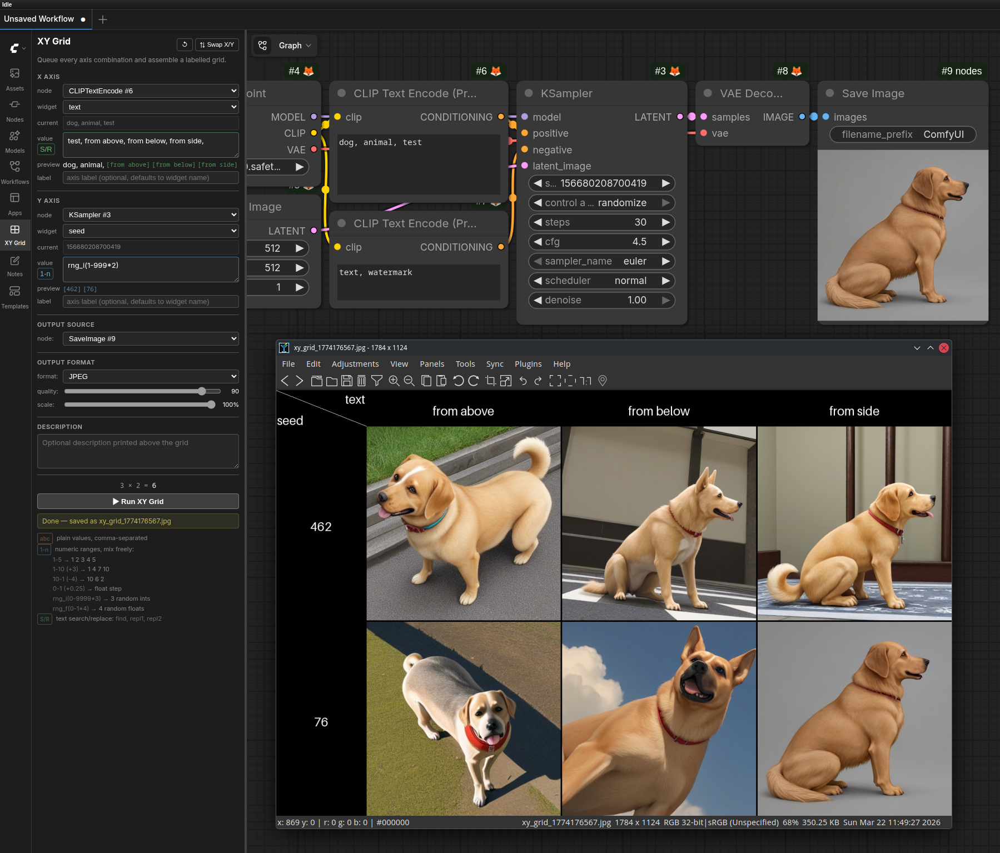

# ComfyUI XY Grid Sidebar

Explore parameter combinations visually from the ComfyUI sidebar. Pick any two widget inputs as your X and Y axes, define a list of values for each, and the extension queues every combination as a standard ComfyUI prompt. When all runs complete, the results are assembled into a labelled grid image and saved to your output directory.

Works with any node and any workflow. No specialized nodes required. Inspired by [a1111's X/Y/Z Feature](https://github.com/AUTOMATIC1111/stable-diffusion-webui/wiki/Features#xyz-plot).



## Features

### Sidebar UI

- **X axis** and **Y axis** - each independently configurable with a node, widget, and list of values. Only one axis is required (produces a 1D strip).
- **Title bar buttons** - **↺** (refresh) and **⇅ Swap X/Y** sit in the top-right corner. Refresh re-populates all node dropdowns from the live graph, preserving existing selections. Swap exchanges the X and Y axis configurations.
- **Optional axis labels** - custom display names for each axis; falls back to the widget name if left blank.
- **Output source** - select which node's image output to capture (SaveImage, PreviewImage, or any node that produces `ui.images`).
- **Right-click context menu** - right-click any node on the canvas → XY Grid → Set as X axis / Y axis / X and Y axis / output.
- Selecting a node automatically selects its first widget.

### Value Modes

Each axis has a mode button (color-coded) that cycles through three modes. The border of the value input field updates to match the active mode color.

#### `abc` - Plain values (default, orange)

Comma-separated. CSV-style quoting is supported for entries that contain commas:

```
wolf, cat, dog
"a red apple", "a green apple"
darkness, "light, warmth", cold
```

#### `1-n` - Numeric ranges (blue)

Range tokens are expanded automatically; plain values still work and can be mixed in freely.

| Syntax | Example | Result |
|--------|---------|--------|
| Simple range | `1-5` | `1, 2, 3, 4, 5` |
| Range with step | `1-5 (+2)` | `1, 3, 5` |
| Descending | `10-5 (-3)` | `10, 7` |
| Float step | `0-1 (+0.2)` | `0, 0.2, 0.4, 0.6, 0.8, 1` |
| Random integers | `rng_i(0-9999*3)` | 3 random integers in [0, 9999] |
| Random floats | `rng_f(0-1*4)` | 4 random floats in [0, 1] |

Count is optional - `rng_i(0-9999)` gives one value. All tokens can be mixed freely: `1-5, 10, rng_i(0-9999*2)`.

Random values are rolled once when the preview renders and reused on run - what you see in the preview is what gets queued.

#### `S/R` - Text search/replace (green)

For string/text area inputs. The **first entry** is the search keyword; each subsequent entry is a replacement. All occurrences of the keyword in the widget's current value are replaced.

```
an apple, a watermelon, a banana
darkness, "light, warmth", cold
```

The grid label for each variant shows only the replacement term, not the full resulting string.

The widget's current text is shown in the **current:** row so you can verify the search term will match. The **preview:** row shows the full string with each replacement option highlighted inline, e.g.:

```
cat, dog, cake, [yoghurt] [monkey]
```

If the search term is not found in the current widget value at run time, the run is blocked with a warning in the status bar.

### Queuing & Execution

- Queues one prompt per combination via ComfyUI's standard `/prompt` API - no custom execution path.
- Only one XY session runs at a time.
- Progress counter shown during execution.
- Cancelled or failed cells are marked with a grey placeholder; the grid is still assembled with whatever completed.
- Dropped prompts (e.g. from a queue clear) are detected by polling `/queue` every 2 seconds and verified against `/history`.

### Grid Assembly

- Assembled server-side with PIL.
- Column headers (X axis values) along the top, row headers (Y axis values) along the left.
- Corner cell shows axis names with a diagonal separator when both axes are active.
- Long labels are word-wrapped to two lines, then ellipsis-truncated if still too wide.
- Saved as `xy_grid_{timestamp}.png` (or `.jpg`) to ComfyUI's output directory.
- Filename shown in the sidebar on completion.

### Output Format

- PNG or JPEG output, selectable in the sidebar.
- JPEG quality slider (1–100, default 90).
- Scale slider (10% / 20% / 25% / 50% / 100%) applied at image-load time before grid assembly.

### Per-axis previews

Each axis shows two live value previews, labelled and aligned with the other input rows:

- **current:** - the widget's current live value, so you can see what you're working with without switching back to the canvas. Updates in real time as you edit the widget on the canvas (via widget callback patching).
- **preview:** - the values the axis will actually produce, shown as colored tags `[val1] [val2] …`, truncated at 20 with a `+N more` indicator. Tag color matches the active mode (orange for `abc`, blue for `1-n`, green for `S/R`).

Above the Run button a **combo counter** shows how many prompts will be queued: `N × M = P` when both axes are active, or `N prompts` for a single axis.

### Description

Optional free-form text rendered as a full-width bar above the grid image.

### Persistence

All sidebar state (node selections, widget selections, values, labels, mode, format, quality, scale, description) is saved to `localStorage` and restored on next load.
